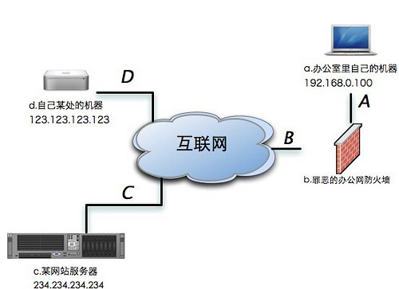
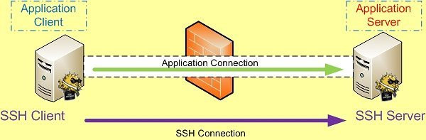
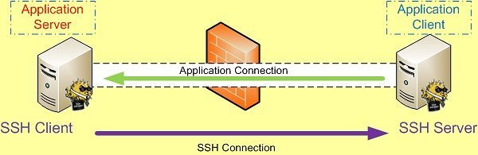
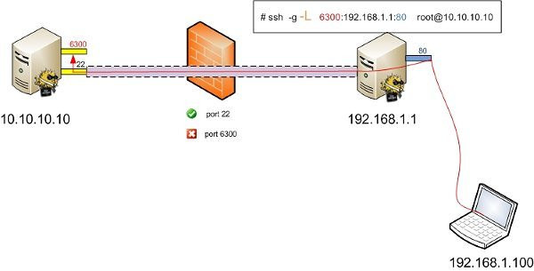

基本问题
========

如果你遇到了以下问题，那么你应该阅读这篇文章

    1. 我听说过这种技术，我对它很感兴趣
    2. 我想在家里访问我在公司的机器（写程序，查数据，下电影）。
    3. 公司为了防止我们用XX软件封锁了它的端口或者服务器地址。
    4. 公司不让我们上XX网站，限制了网址甚至IP。
    5. 公司不让我们看关于XX的信息，甚至花血本买了XX设备，能够对内容进行过滤。
    6. 我爸是搞电脑的，他在家里的路由器上动了手脚，我不能看XXX了。

带着这些问题，我们先从什么是ssh隧道开始。

SSH隧道
=======

首先看下面这张图，我们所面临的大部分情况都和它类似。我们的电脑在右上角，通过公
司带有防火墙功能的路由器接入互联网（当然可能还有交换机什么的在中间连接着你和路
由器，但是在我们的问题中交换机并不起到什么关键性的作用）。右下脚的部分是一个网
站的服务器，它是我们公司防火墙策略的一部分，也就是说公司不希望我们访问这个服务
器。在右上角还有一台机器，它也是属于我们的。但是这台机器并不在我们公司里面，换
句话说他不受到公司防火墙的限制。最后也是最重要的一点是，我们能够在公司通过互联
网直接访问这台机器。或者说这台位于公司防火墙外面的机器需要拥有一个独立的互联网
IP，同时公司的防火墙规则不会屏蔽这台机器，并且这台机器运行着一个OpenSSH服务器。

现在，我们清楚地知道了自己所处的网络环境。并且不难理解我们在公司无法访问那个服
务器的原因是：线路A-B-C上A-B之间的防火墙屏蔽了对那个服务器的访问。与此同时，我
们也很快注意到，线路A-B-D之间、D-C之间是不受阻碍的。相信你已经想到了，在A-B之间
的防火墙不会屏蔽对机器D的访问。因此我们可以通过机器D建立一个通道A-B-D-C，从而访
问到机器C上的数据。

这条通道可以用很多技术来建立，这里我们仅仅介绍如何使用SSH服务器来建立这样一个通
道－－他被称为SSH隧道。 

SSH端口转发
===========

通过SSH隧道使用PortForwarding端口转发来进行翻墙的操作，这里画两个图解释一下。
首先要记住一件事情就是:

SSH端口转发自然需要SSH连接，而SSH连接是有方向的，从SSH Client到SSH Server。

而我们所要访问的应用也是有方向的，应用连接的方向也是从应用的 Client 端连接到应
用的 Server 端。比如需要我们要访问Internet上的Web站点时，HTTP应用的方向就是从我
们自己这台主机(Client)到远处的Web Server。

本地转发
--------

如果SSH连接和应用的连接这两个连接的方向一致，那我们就说它是本地转发。

    ssh -L <local port>:<remote host>:<remote port> <SSH hostname>

*这里的 `<SSH hostname>` 可以填localhost*

远程转发
--------

如果SSH连接和应用的连接这两个连接的方向不同，那我们就说它是远程转发。

    ssh -R <local port>:<remote host>:<remote port> <SSH hostname>

本地转发在本地这台机器上监听一个端口，然后所有访问这个端口的数据都会通过ssh 隧
道传输到远端的对应端口上，下面是例子。

本地端口转发绑定的是 lookback 接口，这意味着只有 localhost 或者 127.0.0.1 才能
使用本机的端口转发 , 其他机器发起的连接只会得到“ connection refused. ”。要想让
其他机器也能共享这个隧道来转发的话需要在配置文件中使用GatewayPorts 关键字，或者
直接命令行下使用"-g"参数。

另外本地转发命令中的 `<remote host>` 和 `<SSH hostname>` 可以是不同的主机。

远程转发与本地转发正好相反，打开ssh隧道以后，在远端服务器监听一个端口，所有访问
远端服务器指定端口都会通过隧道传输到本地的对应端口上，下面是例子。

动态转发
--------

动态转发可以方便地建立SOCKS服务器。如果我们需要借助一台中间服务器访问很多资源，
一个个映射显然不是高明的办法（事实上，高明确实没有用这个方法）。幸好，SSH客户端
为我们提供了通过SSH隧道建立SOCKS服务器的功能。

通过下面的命令我们可以建立一个通过123.123.123.123的SOCKS服务器。

    1.ssh -N -f -D 1080 123.123.123 # 将端口绑定在127.0.0.1上
    2.ssh -N -f -D 0.0.0.0:1080 123.123.123.123 # 将端口绑定在0.0.0.0上

通过SSH建立的SOCKS服务器使用的是SOCKS 5协议，设置应用程序SOCKS代理时要特别注意。

这里是一篇很好的介绍[SSH PortForwarding的文章]
(http://www.ibm.com/developerworks/cn/linux/l-cn-sshforward/)

### SSH的三个强大的端口转发命令：

**转发到远端：ssh -C -f -N -g -L 本地端口:目标IP:目标端口用户名@目标IP**

**转发到本地：ssh -C -f -N -g –R 本地端口:目标IP:目标端口用户名@目标IP**

**转发到远端：ssh -C -f -N -g -D listen_port user@Tunnel_Host**

-C：压缩数据传输。

-f：后台认证用户/密码，通常和-N连用，不用登录到远程主机。

-N：不执行脚本或命令，通常与-f连用。

-g：在-L/-R/-D参数中，允许远程主机连接到建立的转发的端口，如果不加这个参数，只
允许本地主机建立连接。

-L：本地端口:目标IP:目标端口

可以将远端服务器一个端口remote_port绑定到本地端口port，其中-C是进行数据压缩，-f
是后台操作，只有当提示用户名密码的时候才转向前台。-N是不执行远端命令，在只是端
口转发时这条命令很有用处。-g 是允许远端主机连接本地转发端口。-R表明是将远端主机
端口映射到本地端口。如果是-L，则是将本地端口映射到远端主机端口。

将本地机(客户机)的某个端口转发到远端指定机器的指定端口. 工作原理是这样的, 本地
机器上分配了一个 socket 侦听 port 端口, 一旦这个端口上有了连接, 该连接就经过安
全通道转发出去, 同时远程主机和 host 的 hostport 端口建立连接. 可以在配置文件中
指定端口的转发. 只有 root 才能转发特权端口. IPv6 地址用另一种格式说明: port/
host/hostport

-R 本地端口:目标IP:目标端口

将远程主机(服务器)的某个端口转发到本地端指定机器的指定端口. 工作原理是这样的,
远程主机上分配了一个 socket 侦听 port 端口, 一旦这个端口上有了连接, 该连接就经
过安全通道转向出去, 同时本地主机和 host 的 hostport 端口建立连接. 可以在配置文
件中指定端口的转发. 只有用 root 登录远程主机才能转发特权端口. IPv6 地址用另一种
格式说明: port/host/hostport

-p ：被登录的ssd服务器的sshd服务端口。

-D port

指定一个本地机器"动态的"应用程序端口转发. 工作原理是这样的, 本地机器上分配了
一个 socket 侦听 port 端口, 一旦这个端口上有了连接, 该连接就经过安全通道转发出
去, 根据应用程序的协议可以判断出远程主机将和哪里连接. 目前支持 SOCKS4 协议, 将
充当 SOCKS4 服务器. 只有 root 才能转发特权端口. 可以在配置文件中指定动态端口的
转发.

应用举例
--------

1. 将发往本机的80端口访问转发到174.139.9.66的8080端口

    ssh -C -f -N -g -L 80:174.139.9.66:8080

2. 将发往174.139.9.66的8080访问转发到本机的80端口

    ssh -C -f -N -g -R 80:174.139.9.66:8080

-N - 不使用Shell窗口，纯做转发的时候用，如果你在映射完成后继续在服务器上输入命
令，去掉这个参数即可

> 例子A:我们想远程管理服务器上的MySQL,那么使用下面命令

    ssh -L 3306:127.0.0.1:3306 -N

运行这个命令之后，ssh将会自动将服务器的3306映射到本机的3306端口，我们就可以使用
任意MySQL客户端连接 localhost:3306即可访问到服务器上的MySQL了。

> 例子B:一次同时映射多个端口

    ssh -L 8888:www.host.com:80 \
        -L 110:mail.host.com:110 \
        -L 25:mail.host.com:25 user@host -N

这个命令将自动把服务器的80，110，25端口映射到本机的8888，110和25端口以上命令在
ubuntu 9.10 上测试通过...

端口映射让外部用户同时访问内部多个应用
======================================

企业NAT内部有两台服务器，分别为WEB服务器(192.168.0.2)与ERP服务器(192.168.0.2)。
现在企业想让出差在外的员工，也可以通过互联网访问企业内部的这两个应用，如何设计?

### 一、基于端口访问的一般原理

在讲解NAT服务器的具体端口映射配置之前，笔者觉得读者有必要先了解一下基于端口访问
的一般原理。这有利于读者了解下面的具体配置。下面笔者以员工访问WEB服务器为例，谈
谈基于端口访问的基本步骤。假设现在某个用户需要访问WEB服务器，则客户端的浏览器(假
设采用的端口为3000)与WEB服务器(假设采用的端口为80)是如何来进行通信的呢?

　　第一步：发起连接请求。当用户需要查看公司网页时，用户所用的主机会像WEB服务器
发送请求。在这个发起请求的过程中，会有一些参数传递。如在发送请求的过程中，用户
所用的主机需要知道WEB服务器的IP地址、所采用的协议(HTTP)等。另外就是两个端口信息
。一是用户浏览器所用的端口，即为3000。二是WEB服务器网站所用的端口(如果采用的是
HTTP服务，则默认为80端口)。

　　第二步：WEB服务器转发请求。当服务器接受到这个请求后，会分析数据包。他经过分
析包发现，这个请求是要求端口为80的应用软件来负责的。服务器确定了负责人之后，就
会把这个请求转发给具体的负责人，即WEB应用服务器来处理。

　　第三步：服务器会把从WEB应用服务那边反馈回来的网页传送给用户所用的计算机。在
传送的时候，其也会制定要把这个网页给你的那个3000端口(浏览器)对应的应用软件。

　　第四步：用户的计算机收到数据包之后，也会对这个数据包进行分析，来判断需要把
这个数据包转发给哪个端口(应用服务)。分析后发现是转交给3000端口的，就会把这个数
据包转发给浏览器。

### 二、基于端口映射的NAT服务器配置

其实基于端口映射的NAT服务器其工作原理就跟上面这个基于端口访问的工作过程类似。只
是这里的NAT服务器就相当于用户主机，而用户相当于内部的服务器。由于用户需要通过外
网访问企业内部应用的话，通常情况下要求内网服务器也要求有合法的外网IP。只有私网IP
地址的服务器是无法直接跟外部客户进行通信的。为此，如果没有端口映射的话，用户如果
要同时访问内部的WEB服务器与ERP服务器，则就需要有两个公网IP地址。但是，大家都知道
现在公网IP地址严重缺乏。在没有足够多的IP地址的情况下，该如何实现这种需求呢?那就
知道通过端口映射来完成。

如上图所示，用户需要访问企业内部的WEB服务与ERP服务器，他只需要知道NAT服务地址与
WEB服务器与ERP服务器所采用的端口即可。

如果WEB服务器采用的端口为80，ERP服务器所采用的端口为5050。而NAT服务器的IP地址假
设为202.96.92.100的话，那么当用户访问WEB服务器时，只需要输入http://
202.96.92.100即可。由于HTTP协议默认采用的是80端口，故这里不用配置端口号。如果WEB
服务器中把这个端口改为了3000，则在访问的时候就需要使用http://
202.96.92.100:3000(地址+端口号)的形式了。用户要访问内部的ERP服务器也是类似的，只
要把NAT服务器的地址以及ERP服务器所采用的端口在客户端上进行配置即可。

可见通过NAT服务器的端口映射功能，可以让外部用户同时访问企业内部的WEB服务器与ERP
服务器。

那要实现这个需求具体该如何配置呢?

NAT服务器让内部的局域网用户可以连接到互联网，以便用户能够收发互联网邮件、浏览互
联网上的网站等等。但是默认情况下外部用户是不能够访问内部的服务器。如果需要实现以
上功能的话，就需要进行专门的配置。

如上图中，内部局域网计算机(192.168.0.2)为WEB服务器，其采用的端口为80。

如果现在外部用户需要访问这个WEB服务器站点，则用户只知道这个WEB服务器的地址为
202.96.92.100(NAT服务器的地址)。而WEB服务器默认采用的端口为80。当外部用户通过浏
览器访问企业内部的WEB服务器时，他会在浏览器中输入http:// 202.96.92.100路经来连接
网站。

NAT服务器会将此请求发送给内部的计算机WEB服务器(192.168.0.2)，并由WEB服务器将这个
请求转发给端口为80的软件来负责。WEB服务器会将网页传送给NAT服务器，再由NAT服务器
负责将网页传送给外部用户的计算机。

如果用户要访问内部的ERP服务器，其过程也是如此。

那么现在的问题是，NAT服务器怎么判断要把用户HTTP请求发送给服务器(192.168.0.2)而不
是发送给(192.168.0.3)呢?

这主要是根据端口来判断的。也就是说在NAT服务器中有一个端口映射的规则，只要用户访
问的目的端口是80，就把这个请求转发给WEB服务器;若请求的端口是5050，则就把这个请求
发送给ERP服务器。这就是端口映射的实质。了解这个内容之后，那么了解下面的配置也就
简单多了。打开路由和远程访问主控制窗口，选择要配置的服务器。然后选择IP路由选择、
NAT/基本防火墙。并双击右方对外连接的网络接口(注意这里不要选择连接内网的网络接口)
，选择服务和端口标签。然后直接从服务列表中选取要对外开发的服务，如选择WEB服务器
。在公用地址中选择在此接口，表示由互联网服务提供商指派的NAT服务器的公网IP地址。
然后再设置，如果把这个服务请求转发给内部的IP地址为192.168.0.2的WEB服务器。通过这
个简单的配置，就实现基于端口的映射。

### 三、改善NAT服务器的性能与便利性

可见这个端口映射配置是很简单的。但是其难点在于如何提高这个NAT服务器的性能，如何
让用户使用的更加方便。这是网络管理员所需要考虑的。对此笔者有如下几个建议可供大家
参考。

　　1. 利用域名来代替IP地址。当用户访问企业内部的网站服务器时，如果让他们输入服
务器的IP地址，对普通用户来说可能有点难度。要记住这202.96.92.100十一个没有丝毫关
系的数字有很大的难度。如果能够把这个IP地址转换为有实际意义的网址那就最好了。在
企业内部，可以自己部属一个DNS服务器，把IP地址转换为网址。那么内部员工可以直接通
过网址来访问WEB服务器。但是在互联网上，企业可不能自己随便定义域名。为了提高用户
访问的便捷性，企业网络管理员最好能够像当地的域名注册机构，申请一个合适的域名并
关联到自己的NAT服务器公网IP地址。那么以后外部用户访问内部WEB服务器时，只需要输
入像新浪那样的地址就可以了。而不用输入这些难以记忆的地址。

　　2. 如果企业可以申请到多个IP地址的话，那么最好能够分开来部署。即企业可以申请
两个ADSL帐号。其中一个专门用来连接内部的服务器;而另外一个用来内部员工跟互联网的
通信。这么做主要是为了减轻NAT服务器的压力，提高其性能。如企业只有一个ADSL帐号的
话，那么无论是外部用户访问企业内部服务器;还是企业内部员工访问互联网，其数据流都
要通过这台NAT服务器来处理。为此，如果企业数据流量比较大或者NAT服务器配置不怎么
理想的话，那么很可能这个NAT服务器就成为了企业网络访问的瓶颈资源。如果把他们分开
，则可以减轻NAT服务器的压力，提高外部用户访问企业内部服务器的效率。

　　3. 配置合适的ICMP数据包策略，以加强阻挡黑客利用ICMP的攻击行为。使用ICMP攻击
的原理实际上就是通过Ping大量的数据包使得NAT服务器的CPU使用率居高不下而崩溃。一
般情况下黑客通常在一个时段内连续向计算机发出大量请求而导致CPU占用率太高而死机。
而且会使用多台肉鸡同时向NAT服务器发送数据包。基于ICMP的攻击可以分为两大类，一是
ICMP攻击导致拒绝服务;另外一个是基于重定向的路由欺骗技术。无论是哪一类攻击，都会
给NAT服务器产生致命的影响。为此为了NAT服务器的安全，最好配置合适的ICMP包策略。
如可以拒绝响应别人的ICMP请求。如此攻击者就无法对NAT服务器发起ICMP攻击了。

SSH隧道与端口转发及内网穿透
---------------------------

大家都知道SSH是一种安全的传输协议，用在连接服务器上比较多。不过其实除了这个功能
，它的隧道转发功能更是吸引人。下面是个人根据自己的需求以及在网上查找的资料配合
自己的实际操作所得到的一些心得。

SSH/plink命令的基本资料：

首先，再次记下这三个非常强大的命令：

    ssh -C -f -N -g -L listen_port:DST_Host:DST_port user@Tunnel_Host
    ssh -C -f -N -g -R listen_port:DST_Host:DST_port user@Tunnel_Host
    ssh -C -f -N -g -D listen_port user@Tunnel_Host

相关参数的解释：
-f Fork into background after authentication.
后台认证用户/密码，通常和-N连用，不用登录到远程主机。

-L port:host:hostport
**将本地机(客户机)的某个端口转发到远端指定机器的指定端口**. 工作原理是这样的, 本地
机器上分配了一个 socket 侦听 port 端口, 一旦这个端口上有了连接, 该连接就经过安
全通道转发出去, 同时远程主机和 host 的 hostport 端口建立连接. 可以在配置文件中
指定端口的转发. 只有 root 才能转发特权端口. IPv6 地址用另一种格式说明: port/
host/hostport

-R port:host:hostport
**将远程主机(服务器)的某个端口转发到本地端指定机器的指定端口**. 工作原理是这样的,
远程主机上分配了一个 socket 侦听 port 端口, 一旦这个端口上有了连接, 该连接就经
过安全通道转向出去, 同时本地主机和 host 的 hostport 端口建立连接. 可以在配置文
件中指定端口的转发. 只有用 root 登录远程主机才能转发特权端口. IPv6 地址用另一种
格式说明: port/host/hostport

-D port
指定一个本地机器 “动态的’’ 应用程序端口转发. 工作原理是这样的, 本地机器上分配了
一个 socket 侦听 port 端口, 一旦这个端口上有了连接, 该连接就经过安全通道转发出
去, 根据应用程序的协议可以判断出远程主机将和哪里连接. 目前支持 SOCKS4 协议, 将
充当 SOCKS4 服务器. 只有 root 才能转发特权端口. 可以在配置文件中指定动态端口的
转发.

-C Enable compression.
压缩数据传输。

-N Do not execute a shell or command.
不执行脚本或命令，通常与-f连用。

-g Allow remote hosts to connect to forwarded ports.
在-L/-R/-D参数中，允许远程主机连接到建立的转发的端口，如果不加这个参数，只允许
本地主机建立连接。注：这个参数我在实践中似乎始终不起作用。

以上摘录自：http://chenweiguang.blogspot.com/2009/03/ssh.html

### 建立本地SSH隧道例子

在我们计划建立一个本地SSH隧道之前，我们必须清楚下面这些数据：

 1. 中间服务器d的IP地址
 2. 要访问服务器c的IP地址
 3. 要访问服务器c的端口

现在，我们把上面这张图变得具体一些，给这些机器加上IP地址。并且根据下面这张图列
出我们的计划：

 1. 需要访问234.234.234.234的FTP服务，也就是端口21
 2. 中间服务器是123.123.123.123

现在我们使用下面这条命令来达成我们的目的(192.168.0.100上执行)

    ssh -N -f -L 2121:234.234.234.234:21 123.123.123.123

    ftp://localhost:2121 # 现在访问本地2121端口，就能连接234.234.234.234的21端口

这里我们用到了SSH客户端的三个参数，下面我们一一做出解释：

  • -N 告诉SSH客户端，这个连接不需要执行任何命令。仅仅做端口转发
  • -f 告诉SSH客户端在后台运行
  • -L 做本地映射端口，被冒号分割的三个部分含义分别是
      □ 需要使用的本地端口号
      □ 需要访问的目标机器IP地址（IP: 234.234.234.234）
      □ 需要访问的目标机器端口（端口: 21)
  • 最后一个参数是我们用来建立隧道的中间机器的IP地址(IP: 123.123.123.123)

我们再重复一下-L参数的行为。-L X:Y:Z的含义是，将IP为Y的机器的Z端口通过中间服务
器映射到本地机器的X端口。

在这条命令成功执行之后，我们已经具有绕过公司防火墙的能力，并且成功访问到了我们
喜欢的一个FTP服务器了。

### 如何建立远程SSH隧道

通过建立本地SSH隧道，我们成功地绕过防火墙开始下载FTP上的资源了。那么当我们在家
里的时候想要察看下载进度怎么办呢？大多数公司的网络是通过路由器接入互联网的，公
司内部的机器不会直接与互联网连接，也就是不能通过互联网直接访问。通过线路D-B-A访
问公司里的机器a便是不可能的。也许你已经注意到了，虽然D-B-A这个方向的连接不通，
但是A-B-D这个方向的连接是没有问题的。那么，我们能否利用一条已经连接好的A-B-D方
向的连接来完成D-B-A方向的访问呢？答案是肯定的，这就是远程SSH隧道的用途。

与本地SSH一样，我们在建立远程SSH隧道之前要清楚下面几个参数：

  • 需要访问内部机器的远程机器的IP地址（这里是123.123.123.123）
  • 需要让远程机器能访问的内部机器的IP地址(这里因为是想把本机映射出去，因此IP是
    127.0.0.1)
  • 需要让远程机器能访问的内部机器的端口号(端口:22)

在清楚了上面的参数后，我们使用下面的命令来建立一个远程SSH隧道

    ssh -N -f -R 2222:127.0.0.1:22 123.123.123.123

现在，在IP是123.123.123.123的机器上我们用下面的命令就可以登陆公司的IP是
192.168.0.100的机器了。

    ssh -p 2222 localhost

-N，-f 这两个参数我们已经在本地SSH隧道中介绍过了。我们现在重点说说参数-R。该参
数的三个部分的含义分别是:

  • 远程机器使用的端口（2222）
  • 需要映射的内部机器的IP地址(127.0.0.1)
  • 需要映射的内部机器的端口(22)

例如：-R X:Y:Z 就是把我们内部的Y机器的Z端口映射到远程机器的X端口上。

建立SSH隧道的几个技巧
=====================

自动重连
--------

隧道可能因为某些原因断开，例如：机器重启，长时间没有数据通信而被路由器切断等等
。因此我们可以用程序控制隧道的重新连接，例如一个简单的循环或者使用 djb’s
daemontools . 不管用哪种方法，重连时都应避免因输入密码而卡死程序。关于如何安全
的避免输入密码的方法，请参考我的如何实现安全的免密码ssh登录。这里请注意，如果通
过其他程序控制隧道连接，应当避免将SSH客户端放到后台执行，也就是去掉-f参数。

保持长时间连接
--------------

有些路由器会把长时间没有通信的连接断开。SSH客户端的TCPKeepAlive选项可以避免这个
问题的发生，默认情况下它是被开启的。如果它被关闭了，可以在ssh的命令上加上-o
TCPKeepAlive=yes来开启。

另一种方法是，去掉-N参数，加入一个定期能产生输出的命令。例如: top或者vmstat。下
面给出一个这种方法的例子：

    ssh -R 2222:localhost:22 123.123.123.123 "vmstat 30"

检查隧道状态
------------

有些时候隧道会因为一些原因通信不畅而卡死，例如：由于传输数据量太大，被路由器带
入stalled状态。这种时候，往往SSH客户端并不退出，而是卡死在那里。一种应对方法是
，使用SSH客户端的ServerAliveInterval和ServerAliveCountMax选项。
ServerAliveInterval会在隧道无通信后的一段设置好的时间后发送一个请求给服务器要求
服务器响应。如果服务器在 ServerAliveCountMax次请求后都没能响应，那么SSH客户端就
自动断开连接并退出，将控制权交给你的监控程序。这两个选项的设置方法分别是在ssh时
加入-o ServerAliveInterval=n和-o ServerAliveCountMax=m。其中n, m可以自行定义。

如何将端口绑定到外部地址上
--------------------------

使用上面的方法，映射的端口只能绑定在127.0.0.1这个接口上。也就是说，只能被本机自
己访问到。如何才能让其他机器访问这个端口呢？我们可以把这个映射的端口绑定在
0.0.0.0的接口上，方法是加上参数-b 0.0.0.0。同时还需要打开SSH服务器端的一个选项
－GatewayPorts。默认情况下它应当是被打开的。如果被关闭的话，可以在/etc/sshd_config
中修改GatewayPorts no为GatewayPorts yes来打开它。
